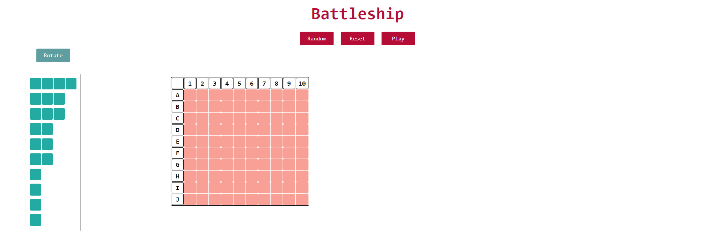
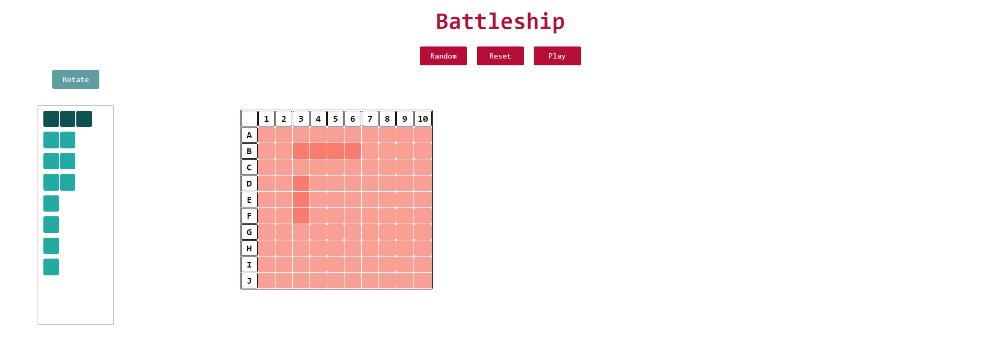
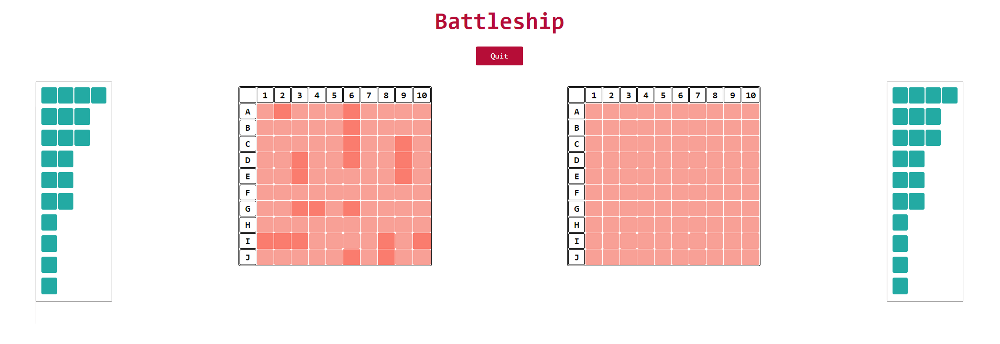

# Battleship

Game implemented from scratch in plain JavaScript, CSS, HTML.

## Description

Battleship is a strategy-type guessing game. 

After placing your ships, you can start guessing where the opposing player's ships are.
The objective of the game is to destroy the opponent's fleet
The first player who sinks all the ships win.

## Features

- random or custom ship placement selection

- matches against AI

## Presentation​

### Start

### Ship placement

### Play mode

