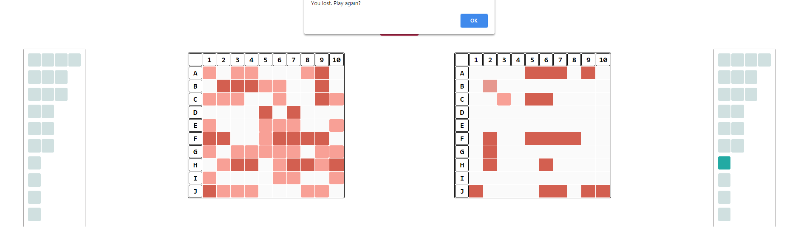

# Battleship Game 

This Battleship game is implemented from scratch using plain JavaScript and follows object-oriented programming (OOP) patterns.

## Description

Battleship is a strategy-type guessing game. 

After placing your ships, you can start guessing where the opposing player's ships are.
Destroy all of the opponent's ships before they destroy yours.
The first player to sink all the opponent's ships wins the game.

## Features

- Choose between random ship placement or manually select and place your ships
- Interact with the opponent's grid to destroy their fleet

## How to Play

1. Game Initialization

- Open the game by launching the `index.html` file in your web browser
  
2. Ship Placement

- Click on the "Random" button to automatically place your ships on the grid
- Alternatively, manually select and place your ships by clicking on the ships and placing them on the grid
- Use the "Rotate" button to rotate the ship's orientation (horizontal or vertical)
- If needed, click the "Reset" button to clear and restart the ship placement process

3. Start the Game

- Click the "Play" button to start the game
- The AI opponent will also place their ships on their grid

4. Guessing and Attacking

- Click on the opponent's grid on the right side of the screen to guess and attack a specific cell
- Watch as the AI opponent strategically attacks your fleet on the left side of the screen

5. End the Game

- At any time, click the "Quit" button to end the game.

## Technologies Used
- HTML
- CSS
- JavaScript

## Presentation​

### Start

### Ship placement

### Play mode

### Shooting

### End game

Enjoy the game and may you achieve victory against the AI opponent!
 
